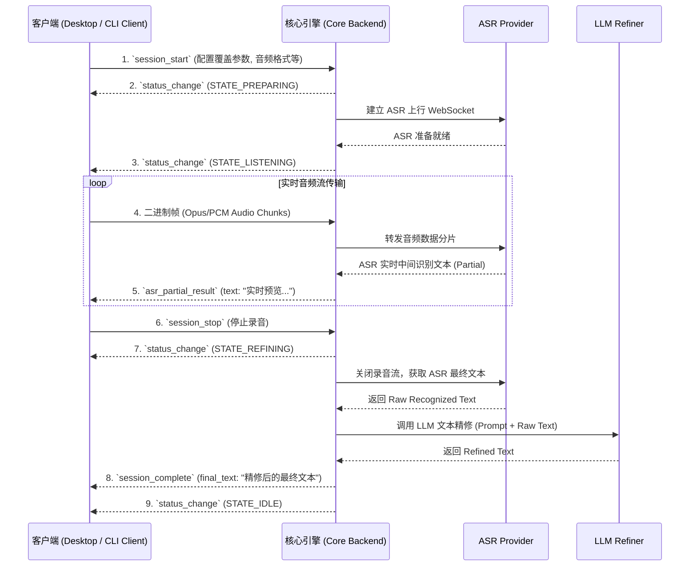
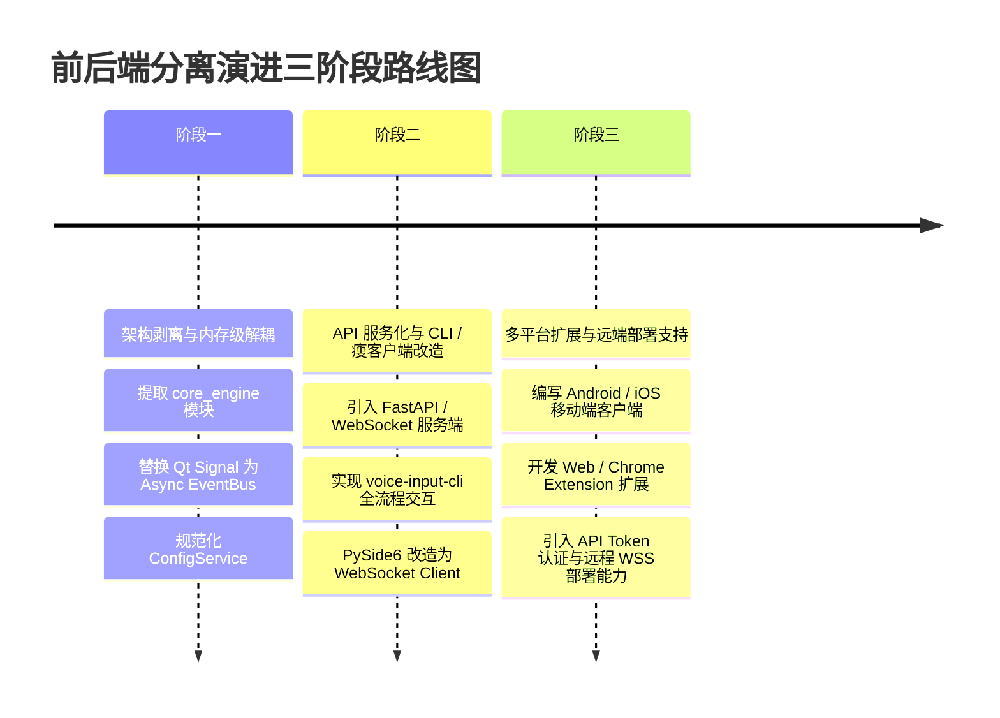

# Voice Input 语音输入系统前后端分离与多平台架构设计方案

## 1. 项目背景与现状分析 (Context & Architectural Analysis)

### 1.1 现状架构概览
当前 `voice-input` 系统是一个标准的**单体桌面应用 (Monolithic Desktop Application)**。应用通过 `src/main.py` 中的 `VoiceInputController` 作为中央调度中枢，借由 PySide6 的信号与槽机制 (Signal/Slot) 将以下模块紧密交织在一起：

```
[ 用户交互 (PySide6 Floating Capsule & Tray) ]
                   │
                   ▼ (Qt Signals / Direct Calls)
      [ VoiceInputController (中枢) ]
         ├── AudioRecorder (sounddevice / PyAudio)
         ├── HotkeyListener (pynput / Win32 API)
         ├── ASR Provider (WebSocket / REST)
         ├── LLM Refiner (OpenAI / Ollama / DeepSeek)
         ├── TextInjector (Win32 Clipboard + SendInput)
         └── ConfigManager / WebDAVSync
```

### 1.2 现状耦合点剖析
1. **界面层与业务逻辑深度绑定 (UI & Core Coupling)**：
   - `VoiceInputController` 既负责 Qt 窗口（[FloatingCapsule](file:///D:/AllProjects/OtherProjects_Workspace/voice-input/src/ui/capsule.py)、[SystemTrayApp](file:///D:/AllProjects/OtherProjects_Workspace/voice-input/src/ui/tray.py)）的显示/隐藏/位置调整，又负责音频录制、ASR 传输、LLM 异步调度与文本注入。
   - 核心流程调度依赖 PySide6 的 `QThread` ([ASRProcessingWorker](file:///D:/AllProjects/OtherProjects_Workspace/voice-input/src/main.py#L32)) 和 `Signal`，无法在无 UI 环境或非 Python GUI 框架（如 Tauri、Web、Mobile）中复用。
2. **硬件/系统 API 依赖散落 (Platform Hardware Coupling)**：
   - 音频采集 (`sounddevice`)、全局按键监听 (`pynput`) 以及文本模拟键入 ([TextInjector](file:///D:/AllProjects/OtherProjects_Workspace/voice-input/src/utils/injector.py)) 均假设直接运行在 Windows 桌面宿主环境中。
3. **数据管道内嵌于内存中 (In-Memory Pipeline)**：
   - 音频 Chunk 直接通过内存中的回调函数发送给 ASR 引擎；识别结果直接传递给 LLM Refiner；最终文本直接传给 Injector。缺乏明确的协议边界。

### 1.3 前后端分离演进动机
为了支撑未来**多平台架构需求**（例如：移动端 App [Android/iOS] 作为输入终端、Chrome/Edge 浏览器扩展、Web 管理后台、跨平台轻量桌面端 [Tauri/Flutter]、全功能 CLI 终端工具、边缘/云端部署高性能 ASR/LLM 服务），必须将**后端核心业务引擎**从桌面 GUI 中解耦出来，形成独立运行、高复用、可通过标准网络协议调用的**无头核心服务 (Headless Core Service)**。

---

## 2. 目标架构图景 (Target Architecture Design)

### 2.1 分层架构示意图

```mermaid
graph TD
    subgraph 客户端层 (Multi-Platform Clients)
        DesktopClient["跨平台桌面客户端 (PySide6 / Tauri / Flutter)"]
        MobileClient["移动端 App (Android Input Method / iOS App)"]
        WebExtension["浏览器插件 (Chrome / Firefox Extension)"]
        CLITool["全功能 CLI 终端工具 (CLI Full-Flow Client)"]
    end

    subgraph 协议与网关层 (Transport & API Layer)
        WSGateway["WebSocket Stream Gateway (实时音频流 / 状态推送)"]
        RESTGateway["RESTful API Gateway (配置 / 状态 / 管理)"]
    end

    subgraph 核心引擎后端 (Headless Core Daemon Engine)
        SessionManager["Session 状态机管理器"]
        PipelineEngine["语音处理管道引擎 (Pipeline Engine)"]
        ConfigService["配置中心 & WebDAV 同步引擎"]
        
        subgraph 适配插件体系 (Provider Hub)
            ASRHub["ASR 服务适配器 (Doubao / Qwen / Xiaomi / OpenAI)"]
            LLMHub["LLM 精修适配器 (Ollama / DeepSeek / OpenAI / Qwen)"]
        end
    end

    subgraph 客户端硬件抽象层 (Client-Side HAL)
        AudioHAL["音频采集抽象 (WebAudio / AudioRecord / WASAPI / sounddevice)"]
        HotkeyHAL["唤醒监听抽象 (Hotkeys / Touch Buttons / Terminal Input)"]
        InjectHAL["文本注入抽象 (SendInput / InputMethodService / DOM / Clipboard / Stdout)"]
    end

    DesktopClient -->|Audio Stream & Commands| WSGateway
    MobileClient -->|Audio Stream & Commands| WSGateway
    WebExtension -->|Control API & Text Receive| RESTGateway
    CLITool -->|Audio Stream, Control & Output| WSGateway

    WSGateway --> SessionManager
    RESTGateway --> ConfigService

    SessionManager --> PipelineEngine
    PipelineEngine --> ASRHub
    PipelineEngine --> LLMHub

    DesktopClient --- AudioHAL
    DesktopClient --- HotkeyHAL
    DesktopClient --- InjectHAL

    MobileClient --- AudioHAL
    MobileClient --- InjectHAL

    CLITool --- AudioHAL
    CLITool --- HotkeyHAL
    CLITool --- InjectHAL
```

### 2.2 两种灵活部署形态 (Flexible Deployment Modes)

1. **本地守护进程模式 (Local Daemon Mode)**：
   - 后端 Engine 作为独立后台服务（如 Python 守护进程或打包编译的二进制可执行文件）运行在 `127.0.0.1:28080`。
   - 桌面客户端或 CLI 终端均可通过本地 WebSocket 与 Daemon 通信。
   - **特点**：资源占用小、零网络延迟影响、保持与原系统一致的隐私本地化保障。
2. **远程云端/边缘服务器模式 (Remote / Edge Server Mode)**：
   - 后端 Engine 部署在局域网 NAS、边缘服务器或公有云服务器上。
   - 弱终端设备（如无桌面的 Linux 服务器、老旧电脑、移动手机）通过加密 WebSocket (WSS) 接入，由服务器集中完成多供应商 ASR 转换与高规格 LLM 文本精修。
   - **特点**：终端极轻量化、统一集中管理 API Key 和配置、支持命令行 SSH 远程无缝接入。

---

## 3. 通信协议与 API 规范设计 (Communication & Protocol Specifications)

后端统一暴露两类通信接口：**RESTful API**（用于配置管理与状态查询）与 **WebSocket API**（用于双向实时语音流与状态通知）。

### 3.1 RESTful 管理接口 (Control Plane)

| Endpoint | Method | 说明 |
| :--- | :--- | :--- |
| `/api/v1/health` | GET | 检查后端守护进程运行状态与已加载的 Provider 模块 |
| `/api/v1/config` | GET / PUT | 查询/更新全局配置（ASR、LLM、代理、热键策略） |
| `/api/v1/config/sync` | POST | 触发 WebDAV 手动/自动同步 |
| `/api/v1/models/ollama` | GET | 获取本地 Ollama 可用模型列表 |
| `/api/v1/providers` | GET | 查询当前启用的 ASR 与 LLM 供应商名称与连通性 |

### 3.2 WebSocket 实时流通道 (Data & Event Plane)

* **连接地址**：`ws://127.0.0.1:28080/ws/v1/voice-session`
* **交互时序与消息类型 (JSON / Binary)**：



---

## 4. 无 GUI 环境下全流程 CLI 客户端设计 (Full-Flow CLI Client Design)

为满足**无图形界面 (Headless)** 环境下的完整使用体验，系统提供一个强大的终端命令行工具 `voice-input-cli`。它不仅能进行后台守护进程的管理与配置查改，还完全支持**全流程语音输入、实时终端动态渲染与管道数据输出**。

### 4.1 CLI 功能结构树

```text
voice-input-cli
├── daemon               # 后台守护进程生命周期管理
│   ├── start            # 启动后端 Daemon (Headless 模式)
│   ├── stop             # 停止后端 Daemon
│   ├── restart          # 重启服务
│   └── status           # 检查 Backend 运行状态与端口占用
├── config               # 基础配置与交互式 TUI 管理
│   ├── show             # 查看当前有效配置
│   ├── set <key> <val>  # 命令行快捷设置参数
│   ├── tui              # 启动终端 Rich 交互式配置菜单
│   └── sync             # 触发 WebDAV 增量同步
└── record               # 【全流程】命令行语音输入与实时响应
    ├── --duration <sec> # 指定录音时长模式 (如 5 秒自动结束)
    ├── --push-to-talk   # 长按回车/空格按键录音模式
    ├── --copy           # 结果自动写至系统剪贴板 (默认开启)
    └── --raw            # 纯文本模式输出至 stdout (适用于 UNIX 管道)
```

### 4.2 全流程 CLI 语音输入交互体验

当在终端中运行 `voice-input-cli record` 时，终端将利用 ANSI 转义序列与 `Rich` 库实现极其动态且生动的 UI 体验：

```text
$ voice-input-cli record --push-to-talk
[Press ENTER to start recording, Press ENTER again to stop]

🎤 LISTENING | Audio Level: ▂▄▆█▇▅▃ (16kHz PCM)
─── Real-time ASR Output ─────────────────────────
>> 今天天气真不错，准备出去散散步

⏳ REFINING | Connecting to DeepSeek V3... ⠋

✨ FINISHED | Processed in 1.2s:
--------------------------------------------------
今天天气真不错，准备出去散散步。
--------------------------------------------------
[✓] Text successfully copied to system clipboard!
```

### 4.3 UNIX 管道与自动化脚本集成 (Pipeline Integration)

得益于无头后端与 CLI 客户端设计，用户可以将语音输入直接接入标准 UNIX/Windows 命令行管道：

```bash
# 示例 1: 语音直接追加输入到本地笔记文件
$ voice-input-cli record --raw >> ~/notes.md

# 示例 2: 语音输入文本配合 xclip / clip 直接写剪贴板
$ voice-input-cli record --raw | clip

# 示例 3: 结合 LLM CLI 工具进行语音命令行对话
$ voice-input-cli record --raw | ollama run llama3
```

---

## 5. 后端核心引擎模块化解耦 (Backend Modular Architecture)

后端核心拆分为四大解耦模块，不再强依赖 PySide6 或任何 UI 框架：

```
src/backend/
├── main_daemon.py             # 后端无头服务入口 (FastAPI / Asyncio Server)
├── engine/
│   ├── session_manager.py     # 会话生命周期与状态机管理 (Async State Machine)
│   ├── pipeline.py            # 流式处理管道调度 (Audio -> ASR -> LLM)
│   └── event_bus.py           # 进程内部轻量 Pub/Sub 事件总线
├── providers/
│   ├── asr/                   # 抽象 ASR Provider 接口与各供应商实现
│   └── llm/                   # 抽象 LLM Provider 接口与各供应商实现
└── services/
    ├── config_service.py      # 配置管理服务 (单源真实数据源)
    └── sync_service.py        # WebDAV 异步同步后台任务
```

---

## 6. 客户端硬件抽象层 (Client Hardware Abstraction Layer - HAL)

为了实现真正意义上的“多平台架构”，将原生设备绑定操作完全移至**客户端 (Client Side)**，后端只关心标准的标准数据流（如 PCM/Opus 字节流与字符串）。

### 6.1 硬件/平台能力矩阵

| 平台 | 音频采集 (Audio HAL) | 按键/手势唤醒 (Hotkey HAL) | 文本注入 (Injector HAL) |
| :--- | :--- | :--- | :--- |
| **Windows 桌面** | `sounddevice` / WASAPI | Win32 API (`pynput`) | `SendInput(Ctrl+V)` + 剪贴板 |
| **macOS 桌面** | CoreAudio | CGEvent Tap / Accessibility | `CGEvent` 模拟粘贴 / Clipboard |
| **Android 客户端** | `AudioRecord` / OpenSL ES | IME 键盘唤醒按钮 / 悬浮球 | `InputMethodService.commitText` (原生输入法注入) |
| **iOS 客户端** | `AVAudioEngine` | 应用内长按手势 | 系统剪贴板 / 自定义键盘扩展 |
| **CLI 终端客户端** | `sounddevice` / PyAudio | Terminal Enter / Hotkey / Signal | System Clipboard / Stdout Pipe |
| **Web / 扩展** | `navigator.mediaDevices` | 网页全局快捷键 / 悬浮图标 | `document.execCommand` / DOM Node 修改 |

---

## 7. 平滑演进与迁移路线图 (Migration Roadmap)

为确保项目平稳过渡且不破坏现有 Windows 桌面版功能，建议采用**渐进式三阶段重构策略**：



---

## 8. 关键技术选型与风险评估 (Tech Stack & Risk Evaluation)

### 8.1 技术选型建议
* **后端 Daemon 框架**：`FastAPI` + `uvicorn` (Python 异步高性能首选)。
* **CLI 工具库**：`typer` / `click` (命令行参数解析) + `rich` (终端字符动画与文本排版)。
* **客户端选型**：
  * 本地 CLI：`voice-input-cli` 全流程终端客户端。
  * 现阶段桌面：保留 PySide6 改造为 WebSocket 瘦客户端。
  * 未来跨平台：`Tauri` (Rust + Web UI) 或 `Flutter`。

### 8.2 风险与应对策略

| 风险点 | 影响评估 | 应对与优化策略 |
| :--- | :--- | :--- |
| **无桌面系统的音频采集权限** | SSH 远程登录时声卡驱动不可用 | CLI 增加 `--server` 与 `--local-mic` 分离机制，支持客户端麦克风透传 |
| **网络通信延迟 (IPC Overhead)** | WebSocket 传输增加 1-3ms 延迟 | 在本地 127.0.0.1 环境下采用非阻塞异步套接字，延迟可忽略不计 |
| **多平台安全与隐私** | 远程部署时 API Key 暴露风险 | 增加 TLS/WSS 加密，配置文件敏感信息采用 AES-GCM 本地加密存储 |

---
*本方案为设计思考与架构演进指南，遵循不侵入修改现有源码原则，旨在为 Voice Input 系统的未来多平台化提供清晰的落地方向。*
